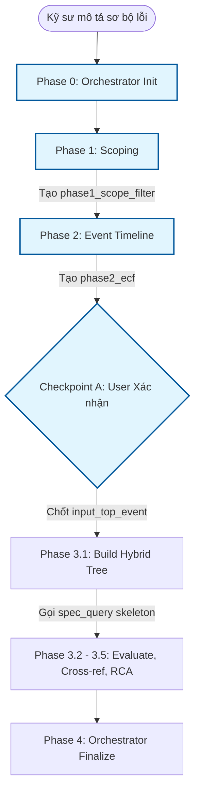
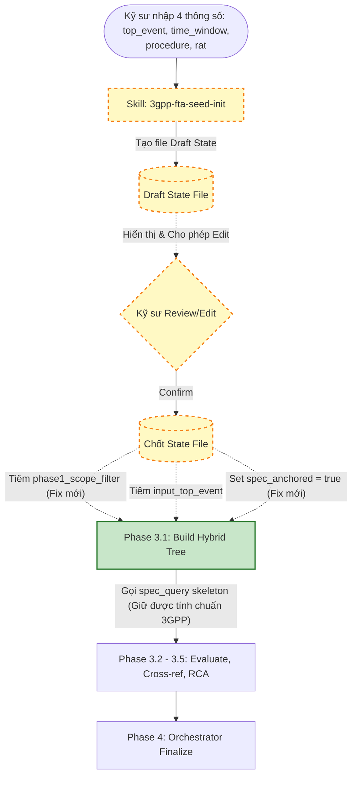

# Design Document: 3GPP FTA Seed-Init Bypass (v6.1)

## 1. Mục tiêu (Objective)
Skill `3gpp-fta-seed-init` được thiết kế để tạo ra một đường tắt (Fast-Track) cho hệ thống 3GPP UE RCA v6. Thay vì bắt buộc hệ thống phải chạy qua Phase 1 (Scoping) và Phase 2 (Timeline generation) tốn thời gian đối với các lỗi đã biết rõ, kỹ sư có thể khởi tạo trực tiếp trạng thái RCA (State File) từ một sự kiện lỗi cụ thể và nhảy thẳng vào Phase 3 (Fault Tree Analysis).

## 2. Lý do thay đổi (Reason for Change / The Problem)
Thiết kế ban đầu của bản nháp `3gpp-fta-seed-init` có một lỗ hổng kiến trúc nghiêm trọng:
- Nó chỉ yêu cầu kỹ sư cung cấp `top_event` và bỏ qua hoàn toàn việc tạo khối dữ liệu `phase1_scope_filter`.
- Thiếu `phase1_scope_filter` (cụ thể là thiếu `procedure` và `rat`) khiến hệ thống phải thiết lập cờ `spec_anchored = false` ở đầu vào của Phase 3.
- Hậu quả: Phase 3.1 không thể tra cứu tài liệu 3GPP bằng công cụ `spec_query skeleton` mà rơi vào cơ chế dự đoán thuần túy của LLM (hallucination-prone hypothesis generation). Điều này vi phạm nguyên tắc "Spec-Anchored" cốt lõi của v6.

## 3. Nội dung thay đổi (What Changed)
Để giải quyết lỗ hổng trên và tạo ra một "Perfect Bypass", thiết kế hiện tại áp dụng các thay đổi:
1. **Input yêu cầu khắt khe hơn:** Kỹ sư bắt buộc phải cung cấp đủ 4 tham số: `top_event`, `scope_window`, `procedure`, và `rat`.
2. **Tiêm State (State Injection):** Skill tự động tổng hợp 4 tham số này và "tiêm" một khối `phase1_scope_filter` hợp lệ vào State File.
3. **Kích hoạt Spec-Anchored:** Skill ép buộc cờ `spec_anchored = true` trên sự kiện gốc, đảm bảo Phase 3.1 luôn dùng 3GPP specs.
4. **Bổ sung tính năng Review (UX Upgrade):** Sau khi khởi tạo State File, file nháp (draft) được hiển thị để kỹ sư có thể xem và sửa đổi trực tiếp (Interactive Editing) trước khi chốt luồng chạy.

## 4. Cách thức thay đổi (How it Changed)
Kiến trúc tổng thể của v6 không bị phá vỡ nhờ áp dụng nguyên lý **Additive-Only (Open-Closed Principle)**:
- **Tách biệt hoàn toàn (Decoupled):** Skill `3gpp-fta-seed-init` không gọi bất kỳ skill nào khác, nó chỉ đóng vai trò là công cụ tạo file State (State-file generator).
- **Cập nhật Dispatcher (`rca.md`):** Luồng làm việc chính được bổ sung thêm một nhánh `Case: phase2_confirmed_via_seed`. Các ca chạy thông thường không bị ảnh hưởng.
- **Bảo toàn Audit (`keyword-provenance-rules.md`):** Thêm một ngoại lệ duy nhất (carve-out) cho dữ liệu có mác `ENGINEER_PROVIDED`. Toàn bộ các suy luận do AI tạo ra sau đó trong Phase 3 vẫn phải trải qua Audit nghiêm ngặt.
- **Orchestrator Bypass (`3gpp-rca-orchestrator`):** Thêm câu lệnh điều kiện `if meta.mode != "seed_and_run"` để bỏ qua bước kiểm tra `phase2_ecf` đối với nhánh đi tắt, trong khi vẫn kiểm tra gắt gao đối với nhánh chạy chuẩn.

## 5. Flow trước và sau khi áp dụng Bypass

### Luồng chuẩn (Standard RCA Flow)
Quy trình đi qua tất cả các pha để tự động bóc tách dữ liệu trước khi vào FTA.



### Luồng đi tắt (Bypassed Flow sử dụng Seed-Init v6.1)
Bỏ qua hoàn toàn Phase 0, Phase 1, Phase 2 và Checkpoint A. Sinh ra trực tiếp dữ liệu mồi hợp lệ và cho phép sửa đổi trước khi chốt.



---

## Phụ lục: Phân tích JSON State (Trước và Sau khi Vá Lỗi)

### TRƯỚC KHI VÁ (Thiết kế cũ - Lỗi mất Spec-Anchored)
```json
{
  "meta": {
    "mode": "seed_and_run",
    "current_phase": "phase2_confirmed_via_seed"
  },
  // THIẾU phase1_scope_filter
  "fta_iterations": [
    {
      "iteration_id": 1,
      "input_top_event": {
        "event": "RRC Connection Re-establishment Reject",
        "source": "ENGINEER_PROVIDED",
        "spec_anchored": false,  // Ép Phase 3.1 vào luồng đoán mò (LLM hallucination)
        "scope_window": { "start_ms": 14000, "end_ms": 15000 }
      }
    }
  ]
}
```

### SAU KHI VÁ (Thiết kế hiện tại - Perfect Bypass)
```json
{
  "meta": {
    "mode": "seed_and_run",
    "current_phase": "phase2_confirmed_via_seed"
  },
  "phase1_scope_filter": { // [MỚI] Được tiêm vào để cung cấp ngữ cảnh cho Phase 3.1
    "procedure": "LTE RRC Connection Re-establishment",
    "rat": "LTE",
    "time_window": { "start_ms": 14000, "end_ms": 15000 }
  },
  "fta_iterations": [
    {
      "iteration_id": 1,
      "input_top_event": {
        "event": "RRC Connection Re-establishment Reject",
        "source": "ENGINEER_PROVIDED",
        "spec_anchored": true, // [MỚI] Chìa khóa để Phase 3.1 gọi chuẩn 3GPP specs
        "scope_window": { "start_ms": 14000, "end_ms": 15000 }
      }
    }
  ]
}
```
