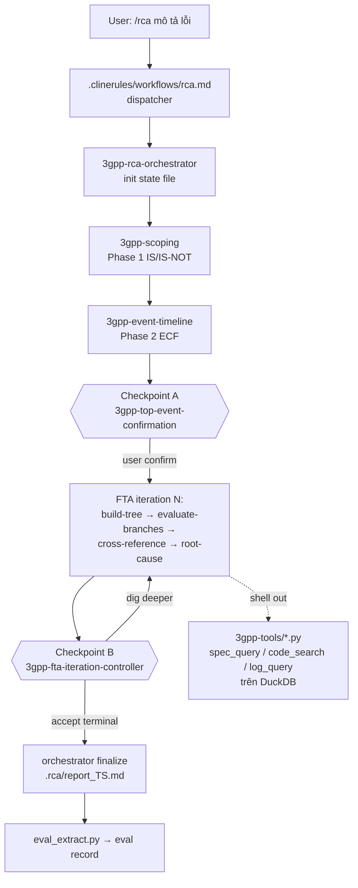

# Phân tích dự án RCA v6 — hiệu quả, token, local LLM, và tích hợp Cline Agent Analyzer

> Tài liệu này trả lời 5 câu hỏi: (1) giải pháp đánh giá hiệu quả pipeline,
> (2) phân tích kiến trúc project, (3) phân tích skills/workflow bằng công cụ
> **Cline Agent Loop Analyzer** (repo `cline-agent`), (4) giải pháp tối ưu
> token trước khi request đến LLM, (5) chỗ nào trong RCA dùng được **local
> LLM**. Phần tích hợp hiển thị output file lên dashboard cline-agent được mô
> tả ở mục 7. Các con số đo trực tiếp từ repo tại thời điểm viết.

---

## 1. Tổng quan kiến trúc RCA v6

Pipeline RCA v6 là một **bộ 13 skill Cline + 2 workflow**, không có server hay
process riêng — "runtime" của nó chính là vòng lặp agent của Cline:



Các bất biến quan trọng (từ `.clinerules/3gpp-rca-collaboration.md`):

| Bất biến | Ý nghĩa vận hành |
|---|---|
| State file là nguồn sự thật duy nhất (`/tmp/rca_state_<ts>.json`) | Resume được từ mọi điểm halt; đồng thời là **bản ghi telemetry miễn phí** cho evaluation |
| Table isolation (signaling vs trace) enforced ở tool layer | Chống "nhảy cóc" bằng chứng; vi phạm bị chặn từ script, không phụ thuộc LLM tuân thủ |
| Keyword provenance theo iteration | Chống hallucination: mọi keyword query phải xuất phát từ output tool trước đó |
| User gates bắt buộc (Checkpoint A/B, không có fast mode) | Mỗi vòng FTA đều có người xác nhận — nguồn dữ liệu agreement-rate |
| Hard termination — không sinh fix | Ranh giới trách nhiệm rõ; validator ở finalize bắt vi phạm |

**Đánh giá:** kiến trúc "mọi thứ đi qua state file + tool Python enforce
constraint" là điểm mạnh nhất của v6 — nó làm cho hai việc phía dưới (đánh giá
hiệu quả và tối ưu token) khả thi mà không phải sửa hành vi pipeline. Rủi ro
chính: (a) chi phí token của bộ skill khá lớn (mục 4), (b) toàn bộ suy luận
nằm ở model của Cline nên chất lượng phụ thuộc model mạnh (mục 5), (c) chưa
có nơi tập trung xem output của run (đã giải quyết ở mục 7).

---

## 2. Giải pháp đánh giá hiệu quả

Repo đã có sẵn một framework đánh giá đầy đủ trong `evaluation/`
(`rca-evaluation-framework.md`, spec, schema, 4 script). Tóm tắt và định vị:

1. **Tầng per-run (online, mọi máy):** `eval_extract.py` chạy tự động khi
   phase = `complete` (bước cuối workflow `/rca`) → eval record JSON ẩn danh
   trong `.rca/eval/outbox/`. KPI online chủ lực: **agreement rate** tại
   Checkpoint A/B (không cần golden label).
2. **Tầng tổng hợp (cron/CI):** `eval_ingest.py` (DuckDB, idempotent) →
   `eval_judge.py` (LLM-as-judge, rubric 6 chiều) → `eval_report.py`
   (dashboard + KPI gate; gate fail = không merge thay đổi skill).
3. **Tầng offline benchmark:** golden set ≥ 20 case đã đóng, đo root-cause
   accuracy L1/L2/L3, time-to-RCA so với manual dev, chấm mù.

**Khoảng trống mà framework hiện tại chưa đo — và cline-agent lấp được:**
eval record đo *kết quả* (đúng/sai, thời gian, agreement) nhưng không đo
*quá trình agent* (token, cost, cache, vòng lặp thừa, hành động lệch kế
hoạch). Đó chính là dữ liệu mà **Cline Agent Loop Analyzer** trích từ log
`ui_messages.json` của chính run đó. Giải pháp đánh giá hoàn chỉnh = ghép hai
lớp:

| Lớp | Nguồn | Đo gì | Công cụ |
|---|---|---|---|
| Outcome quality | state file → eval record | accuracy, agreement, provenance, duration | `evaluation/` (đã có) |
| Process quality | Cline task log | token in/out, cost, cache hit, turn thừa, plan adherence, lỗi tool, FTA của chính agent loop | `cline-agent` analyzer |

Cách ghép cụ thể: cả hai đều có khóa tự nhiên — eval record có `run_id` +
timestamp, log Cline có `taskId` (epoch ms). Bước đề xuất tiếp theo (chưa làm
trong PR này): thêm trường `cline_task_id` vào eval record lúc extract, để
join `analysis.json` của analyzer với `eval_runs` trong DuckDB, ra được ví dụ
"cost trung bình cho một iteration FTA" hay "iteration nào đốt token nhiều
nhất mà bị user override".

---

## 3. Phân tích skills/workflow bằng cline-agent analyzer

### 3.1 Quy trình phân tích một run RCA

1. Chạy `/rca` như bình thường trong Cline; xong (hoặc đang chạy), lấy folder
   task log của Cline (chứa `ui_messages.json`, `api_conversation_history.json`,
   `task_metadata.json`).
2. Trong repo `cline-agent`: `node parser.js <folder> --watch` +
   `node serve.mjs` → dashboard `http://localhost:8099/` (skill `cline-agent`
   tự động hoá đúng flow này).
3. Đọc kết quả ở 3 chỗ: tab **Analysis** (findings + health score), tab
   **Performance** (token/cost/cache theo turn), file `analysis.json`
   (machine-readable, schema ở `cline-agent/docs/analysis-schema.md`).

Điểm khớp đáng giá nhất giữa hai project: analyzer có `expectation.js` — nó
parse **các bước trong SKILL.md của skill được invoke** làm "expected plan",
rồi so với những gì agent thực chạy (kept/dropped/added, orphan actions).
Với RCA, nghĩa là từng SKILL.md (scoping, build-tree, …) trở thành **hợp đồng
kiểm tra được**: nếu agent bỏ bước audit checklist hay chạy tool bị cấm ở
phase đó, nó hiện ra thành finding `dropped step` / `off-plan action` — đúng
loại vi phạm mà các "Hard constraints" trong SKILL.md muốn chặn.

### 3.2 Minh hoạ trên run mẫu trong repo

Run mẫu `cline-log/1782757522666` (task "qualcomm sync 08381225" — một run
tooling cùng hệ sinh thái RCA, 29 turns) cho thấy loại tín hiệu thu được:

- **Metrics:** 29 turns / 199 events, 267.5 s, 330 145 tokens in,
  12 664 tokens out, cache hit 100 % (949 248 cache-read tokens).
- **Outcome:** `completed_with_faults`, health score 70/100.
- **Plan adherence 0.6:** 3/5 bước kế hoạch được giữ, 2 bước bị drop,
  18 hành động không khớp phase kế hoạch nào.
- **Findings:** 1 action lỗi (PowerShell), 1 turn chậm bất thường (> 17 s so
  với trung bình 9 s).

Áp cùng lens này vào một run `/rca` thật sẽ trả lời trực tiếp các câu hỏi
tối ưu skill: phase nào tốn token nhất, checkpoint nào làm agent loay hoay
nhiều turn, skill nào hay bị agent "đi lệch" khỏi SKILL.md — tức là **đo được
chất lượng của chính các skill/workflow**, không chỉ chất lượng kết quả RCA.

### 3.3 Điểm cần lưu ý khi phân tích run RCA nhiều iteration

Một run `/rca` là *nhiều* Cline task nối nhau (mỗi lần user gõ `/rca` sau
checkpoint là một task mới). Analyzer đã hỗ trợ nhiều task trong catalog
(`web/tasks.json`) — khi phân tích, parse tất cả folder task của cùng một run
và đối chiếu theo thời gian với `user_decisions[]` trong state file.

---

## 4. Tối ưu token trước khi gửi API request

### 4.1 Hiện trạng đo được (ước lượng 1 token ≈ 4 bytes)

| Thành phần | Kích thước | Token ước tính | Tần suất vào prompt |
|---|---|---|---|
| Frontmatter 13 skill (description) | 10 479 B | **~2 600** | **Mọi request** của mọi task trong workspace (Cline nạp description tất cả skill để chọn) |
| Rule always-on `3gpp-rca-collaboration.md` | 6 603 B | ~1 650 | Mọi request |
| Workflow `/rca` | 8 803 B | ~2 200 | Mỗi lần gõ `/rca` |
| Body SKILL.md (13 skill) | 78 KB | ~19 500 | Từng skill, khi được invoke |
| `_shared/*.md` (5 file) | 61 004 B | ~15 250 | Khi skill tham chiếu (checkpoint formats 14.9 KB, tool templates 13.8 KB, state schema 13.1 KB…) |
| Reference/checklist per-skill | ~50 KB | ~12 500 | Khi skill đọc đến |

Cộng dồn một iteration FTA (4 skill + controller + shared files) dễ vượt
**25–30 K token chỉ riêng instruction**, chưa tính tool output và lịch sử hội
thoại — và lịch sử này tăng đơn điệu qua các turn của một task.

### 4.2 Giải pháp, xếp theo tỷ lệ lợi ích/công sức

1. **Nén frontmatter description (luôn-luôn trả phí).** Mỗi description hiện
   ~170–230 token, nhiều câu là hướng dẫn vận hành (thuộc về body) chứ không
   phải tín hiệu trigger. Rút xuống ≤ 60 token/skill (giữ trigger phrases) →
   tiết kiệm ~**1 800 token trên MỌI request** của workspace. Đây là chỗ rẻ
   nhất, hiệu quả nhất.
2. **Chẻ `_shared/checkpoint-presentation-formats.md` (14.9 KB) theo
   checkpoint.** Skill Checkpoint A chỉ cần section A, controller chỉ cần
   section B — tách 2 file, mỗi skill đọc đúng nửa của nó, tiết kiệm
   ~1 800 token/lần đọc.
3. **State file: giữ kỷ luật slice-read và chuẩn hoá bằng tool.** Rule đã cấm
   đọc eager, nhưng "đọc slice" hiện dựa vào LLM tự giác. Thêm operation
   `state_get <json-path>` vào bộ `3gpp-tools` (Python đọc đúng key và in ra
   JSON gọn) biến kỷ luật thành cơ chế — state file cuối run có thể hàng trăm
   KB, một lần đọc nhầm cả file là mất chục nghìn token.
4. **Nén tool output trước khi vào context.** `log_query.py` v.v. đã in
   "compressed JSON summary" — chuẩn hoá thêm: cap số dòng (ví dụ top-20 +
   `total_matched`), bỏ field null, và với payload lớn ghi ra file phụ rồi in
   đường dẫn (đúng pattern *sidecar* mà cline-agent dùng với ngưỡng 200
   token). LLM cần thấy *bằng chứng đại diện*, không cần thấy toàn bộ.
5. **Prompt caching — sắp xếp để cache hit.** Run mẫu đạt cache hit 100 %:
   với Claude (và đa số provider), phần prefix ổn định (system + rules + skill
   description) được cache. Vì vậy *đừng* xáo trộn nội dung đầu prompt giữa
   các turn (ví dụ đổi rule/description giữa chừng run); mọi nội dung động
   (state slice, tool output) để ở cuối. Chi phí cache-read chỉ ~10 % giá
   thường — giữ được cache hit cao gần như quan trọng ngang giảm kích thước.
6. **Checkpoint = task boundary là một tính năng token.** Mỗi lần user gõ
   `/rca` sau halt, Cline mở task mới → lịch sử hội thoại cũ **không** bị kéo
   theo; mọi context cần thiết đã nằm trong state file. Giữ nguyên thiết kế
   này (không gộp nhiều iteration vào một task dài) chính là cơ chế chống
   phình context tốt nhất của v6.
7. **Bảng "v5 → v6 change" trong các SKILL.md** chỉ có giá trị lịch sử cho
   người bảo trì — chuyển sang `references/` để không chiếm token lúc invoke.
8. **Đo trước khi cắt:** dùng chính cline-agent (mục 3) để xem phase nào đốt
   token thật sự trước khi tối ưu tiếp — tránh tối ưu chay.

---

## 5. Local LLM trong RCA — dùng được ở đâu?

Khảo sát toàn repo: **chỉ có đúng một chỗ code gọi LLM API trực tiếp** —
`evaluation/scripts/eval_judge.py` (trước PR này: Claude API hoặc xuất prompt
cho người chấm). Phần còn lại của pipeline không tự gọi LLM; nó chạy *bên
trong* Cline, nên model do Cline cấu hình quyết định.

| Vị trí | Dùng local LLM được không | Ghi chú |
|---|---|---|
| **LLM-as-judge (`eval_judge.py`)** | ✅ **Đã triển khai trong PR này** | Judge chỉ đọc report + record, task "chấm theo rubric, trả JSON" — vừa sức model local 14B–72B (Qwen 2.5 32B/72B, Llama 3.3 70B). Lợi ích kép: report RCA (nhạy cảm) **không rời máy**, và chấm hàng loạt không tốn API. Bắt buộc giữ bước *hiệu chuẩn judge-vs-human* (Spearman trên ≥ 10 run) trước khi tin điểm. |
| Pipeline chính (scoping → FTA → finalize) | ⚠️ Có thể nhưng không khuyến nghị làm mặc định | Cline cho phép trỏ provider OpenAI-compatible về Ollama/vLLM. Kỹ thuật thì chạy được, nhưng chuỗi suy luận FTA + kỷ luật provenance là loại tác vụ dài, nhiều ràng buộc — model local cỡ vừa sẽ tăng tỷ lệ vi phạm checklist và halt. Nếu muốn thử: chạy trên golden set và so KPI gate (mục 2) trước khi cho dùng thật. |
| `3gpp-tools/*.py` (spec/code/log query) | ✅ Nhưng theo hướng khác | Các tool này là truy vấn DuckDB/FTS, không cần LLM. Nâng cấp tương lai nếu cần semantic search: dùng **local embedding model** (bge-m3, nomic-embed) — cũng là "local LLM" và không đụng API ngoài. |
| Bước phụ trợ rẻ (tóm tắt tool output, nén state slice, dịch report) | ✅ Ứng viên tốt | Đây là các tác vụ "nén thông tin" không cần suy luận sâu — giao cho model local nhỏ chạy như post-processor của tool script (kết hợp với giải pháp 4.2-4). Chưa triển khai, đề xuất làm sau khi có số đo từ analyzer. |

**Đã triển khai trong PR này** (`eval_judge.py`): thêm chế độ OpenAI-compatible
endpoint, ưu tiên trước Claude API khi được cấu hình:

```bash
RCA_JUDGE_BASE_URL=http://localhost:11434/v1 \
RCA_JUDGE_MODEL=qwen2.5:32b \
python evaluation/scripts/eval_judge.py --db rca_eval.duckdb \
    --report report.md --record eval_record.json
# hoặc: --base-url http://localhost:11434/v1 --model qwen2.5:32b
# API key (nếu server yêu cầu): RCA_JUDGE_API_KEY
```

Hoạt động với Ollama, vLLM, LM Studio, llama.cpp server. Điểm ghi vào cùng
bảng `eval_judge_scores` với `judge_model` = tên model local, nên so sánh
judge local vs Claude vs human là một câu SQL.

---

## 6. Điểm mạnh / rủi ro chính (tóm tắt phân tích project)

**Điểm mạnh**
- State-file-centric → resume, audit, evaluation đều "miễn phí".
- Constraint enforce ở tool layer (table isolation, provenance) — không phó
  mặc cho LLM.
- User gates sinh dữ liệu agreement-rate — KPI online không cần golden.
- Progressive disclosure đã có sẵn một phần (SKILL.md body ↔ references/).

**Rủi ro / việc nên làm tiếp**
- Chi phí token instruction lớn (mục 4 — làm mục 4.2-1 và 4.2-2 trước).
- Chưa nối process-metrics (cline-agent) với outcome-metrics (eval DB) —
  thêm `cline_task_id` vào eval record.
- Golden set chưa có case thật trong repo (`evaluation/golden/` mới có
  template) — chưa chạy được benchmark accuracy.
- `3gpp-tools/` không nằm trong repo này (nằm ở workspace máy engineer) —
  không kiểm soát version tool cùng chỗ với skill; cân nhắc đưa vào repo hoặc
  pin version trong state file `meta.tool_dir`.

---

## 7. Hiển thị output file của RCA trên cline-agent dashboard

Triển khai trong PR song song trên repo `cline-agent` (cùng branch): tab
**Artifacts** mới trên dashboard `http://localhost:8099/`, thiết kế
**project-generic và format-generic** theo đúng yêu cầu:

- Repo RCA khai báo output qua manifest **`cline-agent.artifacts.json`** (đã
  thêm ở gốc repo này): RCA reports (`.rca/report_*.md`), state pointer, state
  files (`/tmp/rca_state_*.json`), eval records + judge prompts (outbox), eval
  dashboard, tài liệu evaluation, design docs v6 (HTML/PDF).
- Analyzer đăng ký project trong `artifacts.config.json` (chỉ cần `id` +
  `root`); **project khác bất kỳ** cũng đăng ký được cùng cách — không có gì
  hard-code cho RCA.
- Hai chế độ xem: **Outputs** (các nhóm file đã khai báo) và **All files**
  (toàn bộ cây file của project khi được yêu cầu — bounded walk, loại trừ
  `.git`, `node_modules`…).
- Render theo định dạng: Markdown (kèm bảng + ```mermaid```), JSON
  (pretty-print), HTML (preview sandbox + "Open raw"), CSV (bảng), text/log,
  ảnh, PDF; định dạng khác có nút Download. Truy cập file qua API có
  traversal guard (không bao giờ serve ngoài thư mục đã khai báo).

Chi tiết: `cline-agent/docs/artifacts-viewer.md`.

---

## 8. Thay đổi đi kèm tài liệu này (trong 2 repo, branch `claude/rca-cline-integration-bl000m`)

| Repo | Thay đổi |
|---|---|
| `rca` | Tài liệu phân tích này; manifest `cline-agent.artifacts.json`; `eval_judge.py` hỗ trợ local LLM (OpenAI-compatible); cập nhật `evaluation/README.md`; ignore `.rca/` runtime outputs |
| `cline-agent` | Tab **Artifacts** (server API + UI + traversal guard + unit tests); `artifacts.config.json` mặc định đăng ký repo `rca`; fallback offline cho CDN (lucide/Chart/mermaid) để dashboard không chết trên máy air-gapped; tài liệu `docs/artifacts-viewer.md`; rebuild installer |
